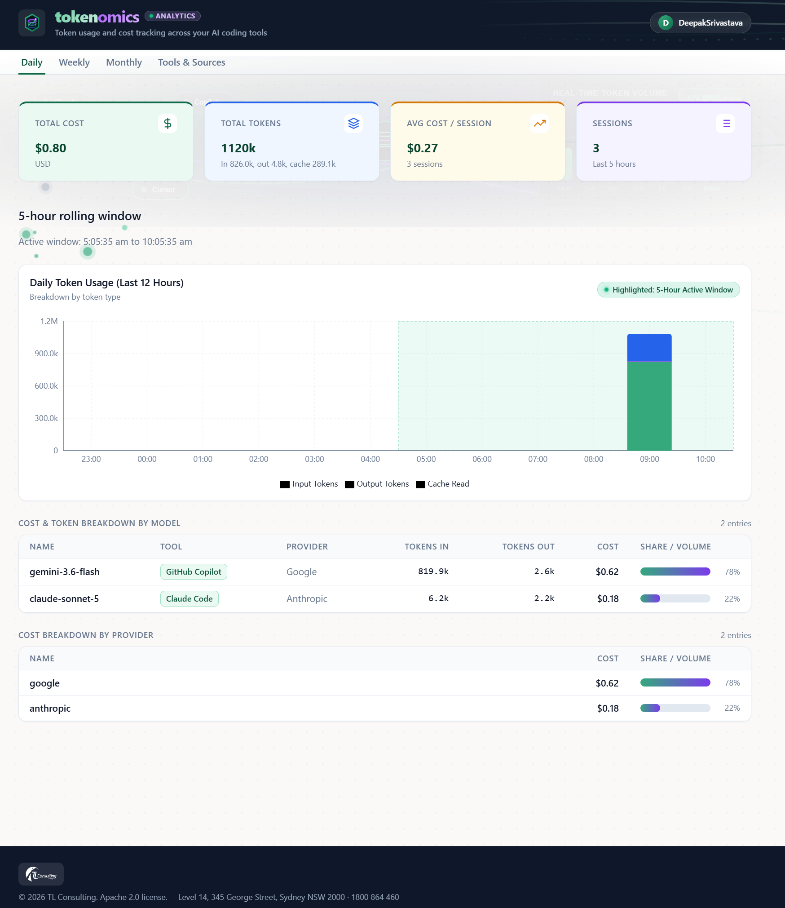
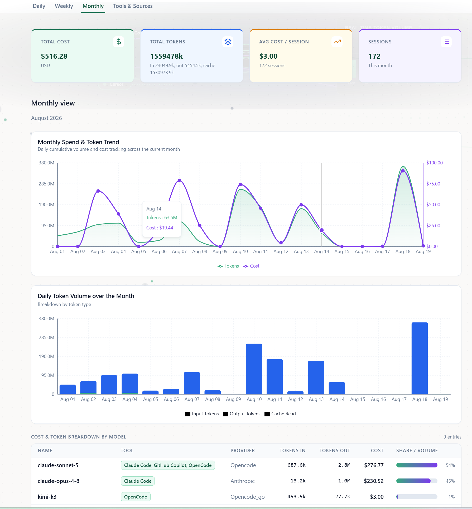

# Tokenomics

A lightweight Tauri desktop app for tracking LLM token usage and costs across the AI coding tools you use locally, no cloud, no accounts, no telemetry. Everything is parsed from local session files on your own machine and never leaves it.

## What it does

Tokenomics scans the local session logs of AI coding tools already installed on your machine and turns them into a cost and token dashboard:

- **Daily** tab: rolling 5-hour window
- **Weekly** tab: rolling 7-day window
- **Monthly** tab: current calendar month
- **Tools & Sources** tab: which tools are being scanned and where their data comes from

Each period tab shows total cost, total tokens (including cache reads/writes), session count, and a per-model breakdown with provider, tokens in, tokens out, and cost.

By default, Tokenomics scans for:

- Claude Code
- OpenCode
- Cursor
- GitHub Copilot CLI

Additional tools can be enabled through the settings panel; the underlying scanner supports a wide range of local AI coding tools beyond the defaults above.

## Dashboard Look & Feel

### Daily View


### Monthly View


## Prerequisites

Tokenomics is a Tauri app: a Rust backend plus a React frontend, packaged as one native desktop app. Both toolchains need to be installed before the first run.

1. **Node.js** 18 or later. Check with `node --version`.
2. **Rust toolchain** (stable), via [rustup](https://rustup.rs/). Check with `rustc --version` and `cargo --version`.
3. **Platform build tools**, required by Tauri to compile the native app shell:
   - **Windows**: [Microsoft C++ Build Tools](https://visualstudio.microsoft.com/visual-cpp-build-tools/) (the "Desktop development with C++" workload) and [WebView2](https://developer.microsoft.com/microsoft-edge/webview2/) (preinstalled on most modern Windows systems).
   - **macOS**: Xcode Command Line Tools, `xcode-select --install`.
   - **Linux**: see the [Tauri Linux prerequisites](https://tauri.app/start/prerequisites/#linux) for your distro's package manager (webkit2gtk, build-essential, etc.).

Full details for less common setups: [Tauri prerequisites](https://tauri.app/start/prerequisites/).

## Quick start

Once the prerequisites above are installed, one command builds the backend, starts the frontend, and opens the app showing your real local token usage data:

```bash
npm install
npm run tauri dev
```

The first run takes a minute or two longer since it compiles the Rust side from scratch; later runs are much faster. The app window that opens is the real thing, not a preview, backed by the actual Rust backend and scanning your real local tool history.

Don't use `npm run dev` alone expecting the full app; that only starts the frontend dev server with no backend behind it, so anything that reads token usage data will fail.

### Other scripts

```bash
npm run lint        # ESLint over src/
npm run typecheck   # tsc --noEmit
npm run test        # Vitest unit tests
```

Rust tests live under `src-tauri/` and run with `cargo test` from that directory.

## Building a release binary

```bash
npm run tauri build
```

The built binary is self-contained; it does not require any other repository or external service to run.

## Architecture

- **Backend**: Rust (Tauri 2). Local file scanning, parsing, and cost aggregation logic lives in `src-tauri/tokenomics-core`, a fully self-contained crate vendored into this repository, plus the Tauri command layer in `src-tauri/src`.
- **Frontend**: React 19 + TypeScript, built with Vite.
- **Storage**: settings are stored locally at `%APPDATA%/tokenomics/settings.json` on Windows (the OS-appropriate config directory elsewhere). No data is sent anywhere.

## License

Apache 2.0
