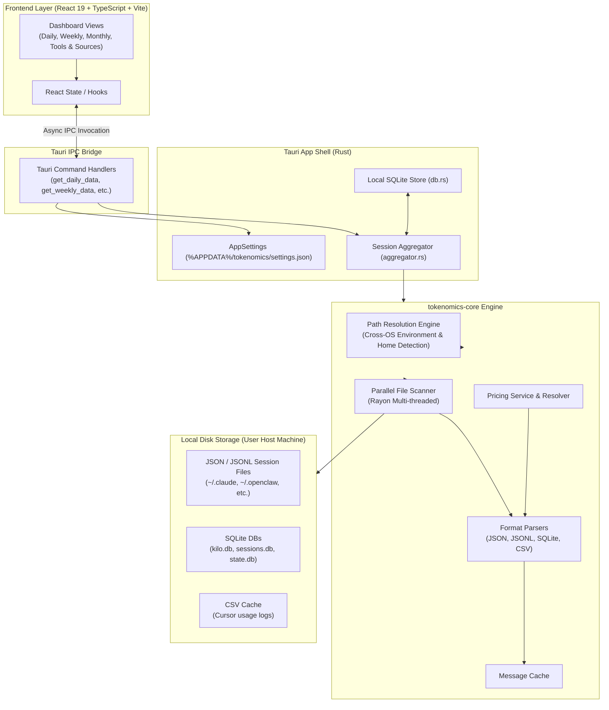
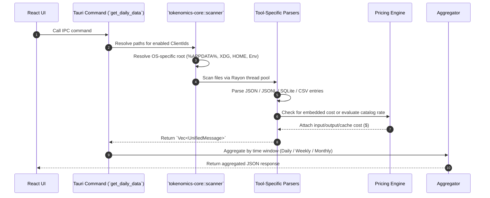
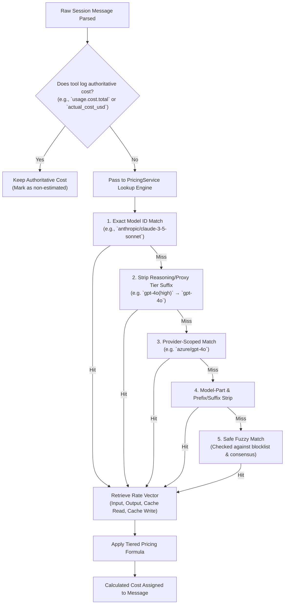

# Tokenomics Architecture Specification

Tokenomics is a native, local-first desktop application designed to track LLM token usage and financial costs across local AI coding tools (Claude Code, Cursor, OpenCode, Codex CLI, GitHub Copilot CLI, Goose, Hermes Agent, Zed, etc.).

It runs **100% locally** on the user's host machine with **zero telemetry, zero external database, and zero cloud accounts required**.

---

## 1. High-Level System Architecture

The application is structured as a dual-layer native app using Tauri 2:
- **Frontend Layer**: React 19 + TypeScript SPA built with Vite.
- **Backend Core**: Tauri Rust app shell backed by `tokenomics-core`, a high-performance local parsing and pricing engine crate.



---

## 2. Technology Stack & Subsystem Roles

| Subsystem | Technology | Purpose & Description |
| :--- | :--- | :--- |
| **Desktop Shell & Packaging** | **Tauri 2 (Rust)** | Provides native windowing, system tray integration, auto-updater, host OS filesystem access, and native execution without a heavy browser runtime. |
| **Frontend UI** | **React 19, TypeScript, Vite, Tailwind CSS** | Renders dashboard views, daily/weekly/monthly cost breakdowns, per-model usage tables, time series charts, and tool source settings. |
| **IPC Communication** | **Tauri `invoke` Handlers** | Asynchronous RPC mechanism connecting React components to Rust backend functions. |
| **Local Data Engine** | **`tokenomics-core` (Rust Crate)** | Vendored core crate providing cross-platform path resolution, session log parsing, parallel file scanning, and pricing catalog resolution. |
| **Multi-Threading / Parallelism** | **`rayon`** | Parallelizes filesystem scanning and parsing of large numbers of local `.json` and `.jsonl` files across CPU worker threads. |
| **Database & Caching** | **`rusqlite` / SQLite** | Local persistence layer for app configuration and message caching to avoid re-parsing unchanged historical session files on start. |
| **Serialization / Parsing** | **`serde`, `serde_json`** | Fast JSON and JSONL deserialization for local session log formats and pricing catalogs. |
| **Path & System Discovery** | **`dirs` Crate** | Platform-agnostic resolution of `%APPDATA%`, `$XDG_DATA_HOME`, `~/Library/Application Support`, and `$HOME`. |

---

## 3. How Tokenomics Reads Local Token Usage

Tokenomics does not attach network proxies or hook into running processes. Instead, it inspects the **local persistent session logs** written directly to disk by AI coding tools.



### 3.1 Supported Log Sources & File Formats

Each tool is identified by a unique `ClientId` and mapped to platform-aware paths:

1. **JSON / JSONL Log Streams**:
   - **Claude Code**: Reads `*.jsonl` files under `~/.claude/projects/` (or `$CLAUDE_CONFIG_DIR`).
   - **OpenCode**: Reads `*.json` files under `$XDG_DATA_HOME/opencode/storage/message/`.
   - **Codex CLI**: Reads `*.jsonl` files under `$CODEX_HOME/sessions/`.
   - **Gemini CLI**: Reads `*.json` / `*.jsonl` files under `$GEMINI_CLI_HOME/tmp/`.
   - **Copilot CLI**: Reads `*.jsonl` telemetry files under `~/.copilot/otel/`.
   - **Roo Code / Kilo Code / Cline**: Reads `ui_messages.json` inside global storage extension directories.
   - **OpenClaw, Pi, Qwen, Droid, Gajae-Code, Grok Build**: Parsed from their respective JSON/JSONL agent session paths.

2. **Embedded SQLite Databases**:
   - **Goose**: Reads `sessions.db` under `$XDG_DATA_HOME/goose/sessions/`.
   - **Hermes Agent**: Reads `state.db` under `$HERMES_HOME/state.db`.
   - **Zed Agent**: Reads `threads.db` under `$XDG_DATA_HOME/zed/threads/`.
   - **Kilo CLI**: Reads `kilo.db`.

3. **CSV Export Caching**:
   - **Cursor IDE**: Parses local `usage*.csv` files cached under `.config/tokenomics/cursor-cache/`.

### 3.2 Data Normalization (`UnifiedMessage`)

Every parsed token usage log entry is converted into a standardized `UnifiedMessage`:

```rust
pub struct UnifiedMessage {
    pub client: String,        // "claude", "opencode", "cursor", "copilot", etc.
    pub model_id: String,      // Raw model ID (e.g. "claude-3-5-sonnet-200000")
    pub provider_id: String,   // Provider ID (e.g. "anthropic", "openai", "google")
    pub session_id: String,    // Unique session/thread identifier
    pub timestamp: i64,        // Unix timestamp in milliseconds
    pub tokens: TokenBreakdown,// Input, Output, Cache Read, Cache Write, Reasoning
    pub cost: f64,             // Authoritative or catalog-calculated cost in USD
}
```

---

## 4. Cost Calculation Engine & Pricing Catalogs

Cost calculation follows a strict **precedence hierarchy** to ensure accuracy without overriding authoritative log data.



### 4.1 Cost Precedence Rules

1. **Authoritative Provider Cost**: If a tool logs exact financial costs directly into its session files (such as Hermes `actual_cost_usd` or Gajae-Code `usage.cost.total`), `has_authoritative_cost()` returns `true`. The pricing engine **never overrides** an authoritative cost.
2. **Dynamic Catalog Pricing**: If no cost is logged, the `PricingService` calculates the spend based on multi-catalog price lookups.

### 4.2 Multi-Catalog Aggregation

`PricingService` merges pricing data from multiple online and offline catalogs:
- **LiteLLM Pricing Catalog**
- **OpenRouter API Pricing Catalog**
- **Models.dev Catalog**
- **Vendor & Built-in Overrides** (e.g. Cursor, Sakana)
- **User Custom Overrides** (`custom_pricing`)

### 4.3 Fuzzy Safety Guards

To prevent mispricing models when matching names:
- **Blocklist Filtering**: Generic tokens like `default`, `model`, `router`, `claude`, `gemini`, `auto`, `mini` are blocked from fuzzy matches so routing labels do not land on random cheap/free keys.
- **Price Consensus**: If multiple fuzzy candidate models match, their rate vectors must agree before the rate is published for cost estimation.

### 4.4 Tiered Token Cost Calculation Formula

Token pricing supports multi-tier volume brackets (e.g. base pricing vs >128k, >200k, >256k, or >272k tokens).

The financial cost for a message is calculated as:

$$\text{Cost} = \sum_{\text{bucket}} \text{TieredCost}(\text{Tokens}_{\text{bucket}}, P_{\text{base}}, \text{Tiers})$$

Expanding across token categories:

$$\text{Total Cost} = \left( T_{\text{in}} \times P_{\text{input}} \right) + \left( (T_{\text{out}} + T_{\text{reasoning}}) \times P_{\text{output}} \right) + \left( T_{\text{cache\_read}} \times P_{\text{cache\_read}} \right) + \left( T_{\text{cache\_write}} \times P_{\text{cache\_write}} \right)$$

Where:
- $T_{\text{in}}$ = Prompt input tokens
- $T_{\text{out}}$ = Completion output tokens
- $T_{\text{reasoning}}$ = Reasoning/thinking tokens (priced at completion output rate)
- $T_{\text{cache\_read}}$ = Cached prompt tokens read
- $T_{\text{cache\_write}}$ = Cache creation/write tokens
- $P$ = Per-token rate derived from the model pricing catalog (e.g. $\$0.000003$ per token = $\$3.00$ / M)

---

## 5. Session Aggregation & Time Windows

Once parsed and costed, messages are grouped by the `Aggregator` into time periods for display:

- **Daily Window**: Aggregates sessions in a rolling 5-hour or 24-hour daily window, broken down into time series data points.
- **Weekly Window**: Aggregates rolling 7-day metrics, broken down by day.
- **Monthly Window**: Aggregates the current calendar month.

### Key Metrics Produced:
- **Total Spend ($)**
- **Total Tokens** (Prompt, Completion, Cache Read, Cache Write)
- **Session Count & Average Cost per Session**
- **Per-Model Breakdown** (Tokens In, Tokens Out, Provider, Total Cost)
- **Per-Provider Breakdown** (Anthropic, OpenAI, Google, etc.)
- **Per-Tool Breakdown** (Which tool triggered the spend)
